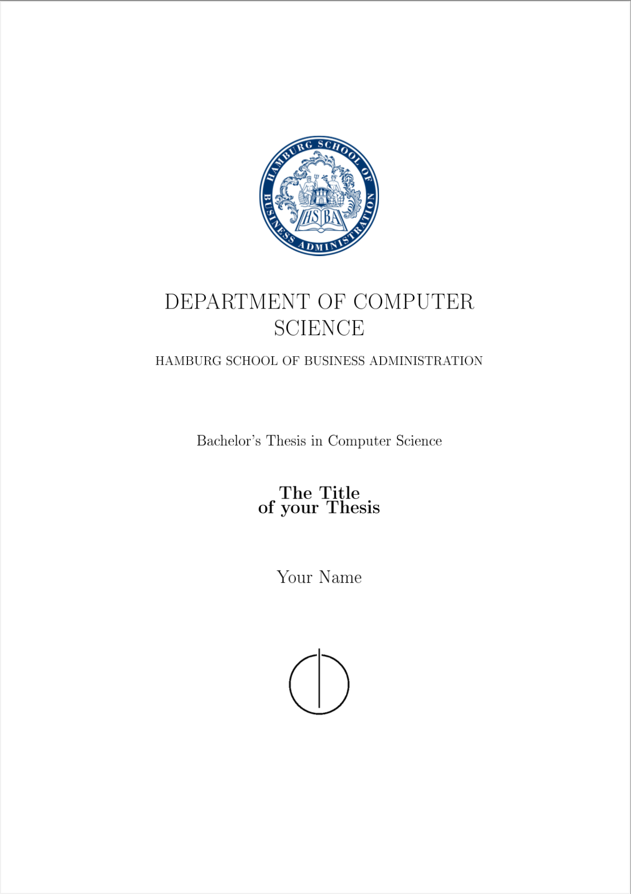

# LaTeX template for HSBA theses

This is a LaTeX template created according to the guidelines for HSBA informatics theses in SS 2021. Always check the current formatting guidelines before you hand in.

        

## Quickstart
* [Download][template-download] and extract the template, or upload it to an online editor such as [Overleaf][overleaf]. If you prefer to use Git, just clone/fork the repository.
  If your editor supports compiling LaTeX, set it up to use `pdflatex` and `biber`. Set the master document to `thesis.tex`.
* To use IntelliJ install the [TeXiFy IDEA Plugin][texify-plugin] extension. Then just open `thesis.tex` and click "run".
* To use Visual Studio Code install the [LaTeX Workshop](https://marketplace.visualstudio.com/items?itemName=James-Yu.latex-workshop) extension. Then as soon as you click on "Save" it automatically compiles your thesis for you without having to configure anything.
* Personalize the template.

## LaTeX
If you are new to LaTeX, the [Overleaf Documentation][overleaf-learn] or the [LaTeX Wikibook][latex-wikibook] might help.

[overleaf]: https://www.overleaf.com/
[overleaf-learn]: https://www.overleaf.com/learn
[latex-wikibook]: https://en.wikibooks.org/wiki/LaTeX
[template-download]: https://github.com/gretasund/bachelor-thesis-template.git
[texify-plugin]: https://plugins.jetbrains.com/plugin/9473-texify-idea